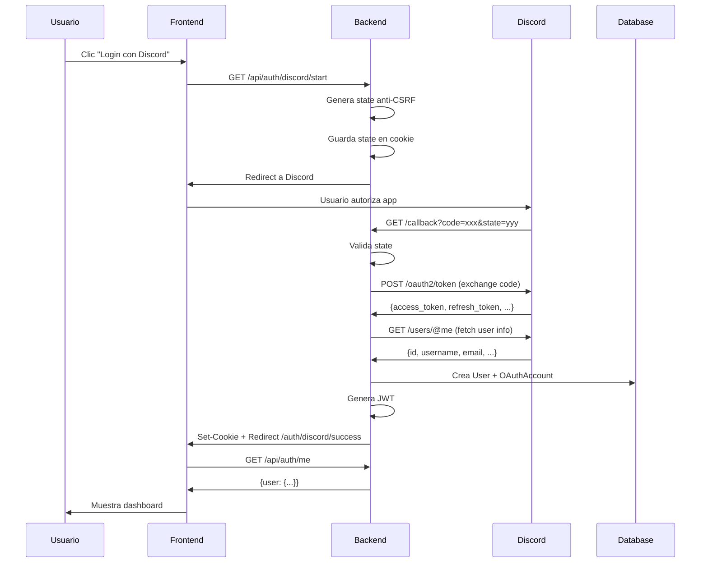
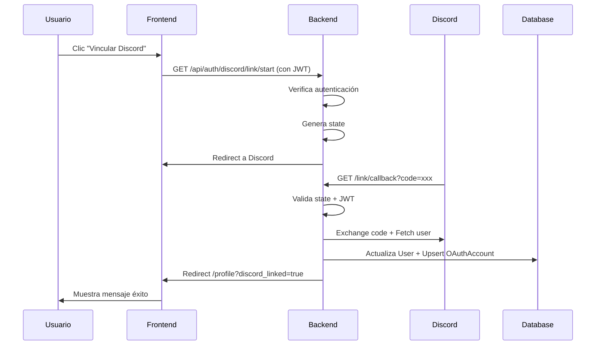
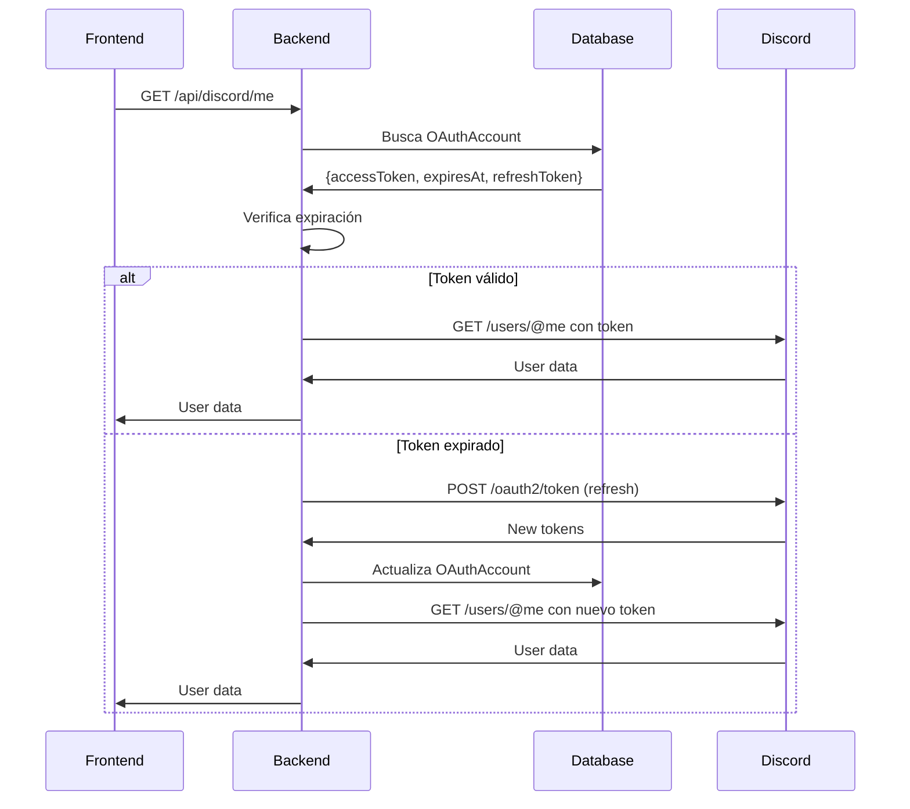

# Integración con Discord - Documentación Completa

## 📋 Índice

1. [Resumen](#resumen)
2. [Características Implementadas](#características-implementadas)
3. [Configuración](#configuración)
4. [Arquitectura](#arquitectura)
5. [Endpoints API](#endpoints-api)
6. [Flujos de Autenticación](#flujos-de-autenticación)
7. [Frontend](#frontend)
8. [Seguridad](#seguridad)
9. [Base de Datos](#base-de-datos)
10. [Ejemplos de Uso](#ejemplos-de-uso)

---

## Resumen

Este proyecto incluye una integración completa con Discord OAuth2 que permite:
- **Login con Discord**: Los usuarios pueden autenticarse usando su cuenta de Discord
- **Account Linking**: Vincular cuentas de Discord a cuentas existentes
- **Token Management**: Gestión automática de tokens con refresh automático
- **Discord API Access**: Acceso a información del usuario, conexiones y guilds

---

## Características Implementadas

### ✅ OAuth2 Login con Discord
- Flujo completo de Authorization Code Grant
- State anti-CSRF con validación
- Creación/actualización automática de usuarios
- JWT en cookies httpOnly para máxima seguridad

### ✅ Account Linking
- Usuarios autenticados pueden vincular su Discord
- Validación de cuentas duplicadas
- Actualización automática de información

### ✅ Token Storage & Refresh
- Almacenamiento seguro de access/refresh tokens
- Refresh automático de tokens expirados
- Validación de expiración antes de cada API call

### ✅ Discord API Endpoints
- `/api/discord/me` - Información del usuario
- `/api/discord/me/connections` - Conexiones del usuario
- `/api/discord/me/guilds` - Servidores del usuario

---

## Configuración

### Variables de Entorno (Backend)

Añade estas variables a tu archivo `.env`:

```env
# Discord OAuth2
DISCORD_CLIENT_ID="tu_client_id"
DISCORD_CLIENT_SECRET="tu_client_secret"
DISCORD_REDIRECT_URI="http://localhost:3000/api/auth/discord/callback"

# Discord Bot (opcional, para fases futuras)
DISCORD_BOT_TOKEN=""
DISCORD_GUILD_ID=""

# Cookie Settings
COOKIE_SECURE="false"          # true en producción (HTTPS)
COOKIE_SAMESITE="lax"          # "none" para cross-site, "strict" para máxima seguridad

# JWT
JWT_SECRET="tu_clave_secreta_muy_segura"
JWT_EXPIRES_IN="7d"

# Frontend URL
FRONTEND_URL="http://localhost:5173"
```

### Configuración de Discord Application

1. **Crear Discord Application**
   - Visita https://discord.com/developers/applications
   - Clic en "New Application"
   - Dale un nombre a tu aplicación

2. **Configurar OAuth2**
   - En tu aplicación, ve a "OAuth2" → "General"
   - Añade Redirect URIs:
     ```
     http://localhost:3000/api/auth/discord/callback
     http://localhost:3000/api/auth/discord/link/callback
     ```
   - En producción, añade también:
     ```
     https://tudominio.com/api/auth/discord/callback
     https://tudominio.com/api/auth/discord/link/callback
     ```

3. **Obtener Credenciales**
   - Copia el `Client ID`
   - Clic en "Reset Secret" para generar un `Client Secret`
   - Añádelos a tu `.env`

4. **Scopes OAuth2 Requeridos**
   - `identify` - Información básica del usuario (obligatorio)
   - `email` - Email del usuario (recomendado)
   - `connections` - Conexiones del usuario (opcional)
   - `guilds` - Servidores del usuario (opcional)

### Cookie Settings Matrix

| Entorno | `COOKIE_SECURE` | `COOKIE_SAMESITE` | Uso |
|---------|----------------|-------------------|-----|
| Local Development (same-site) | `false` | `lax` o `strict` | Frontend y backend en localhost |
| Local Development (cross-site) | `false` | `none` | Frontend y backend en diferentes puertos/dominios |
| Production (same-site) | `true` | `lax` | Frontend y backend en el mismo dominio |
| Production (cross-site) | `true` | `none` | Frontend y backend en diferentes dominios |

**Nota:** Si usas `sameSite: none`, debes usar `secure: true` (requiere HTTPS).

---

## Arquitectura

### Backend

```
backend/src/
├── controllers/
│   ├── auth.controller.ts          # Login, logout, linking
│   └── discord.controller.ts       # Discord API endpoints
├── services/
│   ├── auth.service.ts             # Lógica de autenticación
│   └── discord.service.ts          # Cliente Discord OAuth2/API
├── routes/
│   ├── auth.routes.ts              # /api/auth/*
│   └── discord.routes.ts           # /api/discord/*
├── middlewares/
│   └── auth.middleware.ts          # Autenticación (cookie + header)
├── utils/
│   ├── crypto.ts                   # State anti-CSRF
│   └── jwt.ts                      # JWT con cookies
└── config/
    └── database.ts                 # Prisma client
```

### Frontend

```
frontend/src/
├── components/
│   └── auth/
│       └── DiscordLoginButton.tsx  # Botón login Discord
├── pages/
│   └── auth/
│       ├── LoginPage.tsx           # Login con Discord
│       └── DiscordCallbackPage.tsx # Callback OAuth2
├── services/
│   ├── api.ts                      # Axios con withCredentials
│   └── discordApi.ts               # Query hooks Discord
└── store/
    └── authStore.ts                # Zustand auth state
```

---

## Endpoints API

### Autenticación

#### `GET /api/auth/discord/start`
Inicia el flujo OAuth2 con Discord (login).

**Respuesta:** Redirección a Discord

---

#### `GET /api/auth/discord/callback`
Callback OAuth2 de Discord.

**Query Params:**
- `code` - Código de autorización
- `state` - State anti-CSRF

**Respuesta:** Redirección a frontend con sesión establecida

---

#### `GET /api/auth/discord/link/start`
Inicia el flujo OAuth2 para vincular cuenta (requiere autenticación).

**Headers:**
```
Cookie: token=<jwt>
```

**Respuesta:** Redirección a Discord

---

#### `GET /api/auth/discord/link/callback`
Callback OAuth2 para vincular cuenta.

**Respuesta:** Redirección a perfil con cuenta vinculada

---

#### `GET /api/auth/me`
Obtiene información del usuario actual.

**Headers:**
```
Cookie: token=<jwt>
```

**Respuesta:**
```json
{
  "success": true,
  "message": "Usuario obtenido exitosamente",
  "data": {
    "user": {
      "id": "uuid",
      "email": "user@example.com",
      "nickname": "Username",
      "role": "USER",
      "status": "ACTIVE",
      "discordId": "123456789",
      "discordUsername": "username#0000",
      "clan": { ... }
    }
  }
}
```

---

#### `POST /api/auth/logout`
Cierra sesión (limpia cookie JWT).

**Headers:**
```
Cookie: token=<jwt>
```

**Respuesta:**
```json
{
  "success": true,
  "message": "Logout exitoso",
  "data": null
}
```

---

### Discord API

#### `GET /api/discord/me`
Obtiene información del usuario de Discord.

**Headers:**
```
Cookie: token=<jwt>
```

**Respuesta:**
```json
{
  "success": true,
  "message": "Información de Discord obtenida",
  "data": {
    "discordUser": {
      "id": "123456789",
      "username": "username",
      "global_name": "Display Name",
      "avatar": "hash",
      "email": "user@example.com"
    }
  }
}
```

**Errores:**
- `401` - No autenticado
- `403` - No hay cuenta Discord vinculada o token expirado sin refresh

---

#### `GET /api/discord/me/connections`
Obtiene las conexiones del usuario (Twitch, Spotify, etc.).

**Requiere scope:** `connections`

**Headers:**
```
Cookie: token=<jwt>
```

**Respuesta:**
```json
{
  "success": true,
  "message": "Conexiones obtenidas",
  "data": {
    "connections": [
      {
        "type": "twitch",
        "id": "12345",
        "name": "username",
        "verified": true
      }
    ]
  }
}
```

---

#### `GET /api/discord/me/guilds`
Obtiene los servidores del usuario.

**Requiere scope:** `guilds`

**Headers:**
```
Cookie: token=<jwt>
```

**Respuesta:**
```json
{
  "success": true,
  "message": "Guilds obtenidos",
  "data": {
    "guilds": [
      {
        "id": "123456789",
        "name": "Mi Servidor",
        "icon": "hash",
        "owner": false,
        "permissions": "2147483647"
      }
    ]
  }
}
```

---

## Flujos de Autenticación

### 1. Login con Discord (Usuario Nuevo)



### 2. Login con Discord (Usuario Existente)

Similar al flujo anterior, pero en el paso de BD se actualiza el usuario existente en lugar de crear uno nuevo.

### 3. Account Linking



### 4. Auto-Refresh de Tokens



---

## Frontend

### Componentes

#### DiscordLoginButton

```tsx
import { DiscordLoginButton } from '../../components/auth/DiscordLoginButton';

// Uso
<DiscordLoginButton />
```

Navega a `/api/auth/discord/start` (full page navigation).

---

#### DiscordCallbackPage

Página que se muestra durante el callback OAuth2. Realiza:
1. Fetch a `/api/auth/me` con credentials
2. Actualiza Zustand store
3. Redirige a `/dashboard`

---

### Query Hooks

```tsx
import {
  useDiscordMe,
  useDiscordConnections,
  useDiscordGuilds
} from '../services/discordApi';

function ProfilePage() {
  const { data: discordData, isLoading, error } = useDiscordMe();

  if (isLoading) return <LoadingSpinner />;
  if (error) return <div>No hay cuenta Discord vinculada</div>;

  return (
    <div>
      <h2>{discordData?.data.discordUser.username}</h2>
      <p>{discordData?.data.discordUser.email}</p>
    </div>
  );
}
```

---

### Auth Store

```tsx
import { useAuthStore } from '../store/authStore';

function Component() {
  const user = useAuthStore(state => state.user);
  const logout = useAuthStore(state => state.logout);

  // Logout llama automáticamente a /api/auth/logout
  const handleLogout = async () => {
    await logout();
  };
}
```

---

## Seguridad

### Implementado ✅

1. **State Anti-CSRF**
   - Generado con `crypto.randomBytes(32)`
   - Almacenado en cookie httpOnly temporal (5 min)
   - Validado en callback

2. **JWT en Cookie HttpOnly**
   - No accesible desde JavaScript (XSS protection)
   - Configuración segura (secure, sameSite)
   - Expiración configurable (default: 7 días)

3. **CORS con Credentials**
   - Origin whitelist configurado
   - Credentials habilitado para cookies

4. **Token Refresh Automático**
   - Validación de expiración antes de cada llamada
   - Refresh transparente sin intervención del usuario

5. **Backwards Compatibility**
   - Middleware lee cookie Y header Bearer
   - Migración suave de localStorage a cookies

### Mejores Prácticas

1. **En Producción:**
   - Usa `COOKIE_SECURE="true"` (requiere HTTPS)
   - Configura `COOKIE_SAMESITE` según arquitectura
   - Cambia `JWT_SECRET` a un valor fuerte y único
   - Almacena secrets en variables de entorno seguras

2. **Rate Limiting:**
   - Considera añadir rate limiting a endpoints OAuth2
   - Discord tiene sus propios rate limits (respetados en el código)

3. **Logging:**
   - Todos los eventos OAuth2 se loguean con winston
   - Revisa logs para detectar intentos de CSRF

---

## Base de Datos

### Modelo OAuthAccount

```prisma
model OAuthAccount {
  id                String   @id @default(uuid())
  userId            String
  user              User     @relation(fields: [userId], references: [id], onDelete: Cascade)

  provider          String   // "discord"
  providerAccountId String   // Discord user ID

  accessToken       String?  @db.Text
  refreshToken      String?  @db.Text
  tokenType         String?  // "Bearer"
  scope             String?  // "identify email guilds"
  expiresAt         Int?     // Unix timestamp (epoch seconds)

  createdAt         DateTime @default(now())
  updatedAt         DateTime @updatedAt

  @@unique([provider, providerAccountId])
  @@index([userId])
}
```

### Relación con User

```prisma
model User {
  // ... campos existentes ...
  discordId         String?     @unique
  discordUsername   String?
  oauthAccounts     OAuthAccount[]
}
```

### Migración

```bash
# Backend
cd backend
npx prisma migrate dev --name add_oauth_account
npx prisma generate
```

---

## Ejemplos de Uso

### cURL Examples

#### Login Flow (Manual)

```bash
# 1. Obtener URL de autorización (en navegador)
curl http://localhost:3000/api/auth/discord/start

# 2. Discord redirige con code, backend procesa y establece cookie

# 3. Verificar sesión
curl -X GET http://localhost:3000/api/auth/me \
  -H "Cookie: token=eyJhbGc..." \
  --cookie-jar cookies.txt

# 4. Obtener info Discord
curl -X GET http://localhost:3000/api/discord/me \
  -H "Cookie: token=eyJhbGc..." \
  --cookie cookies.txt
```

---

#### Account Linking

```bash
# 1. Usuario ya autenticado, obtener link URL
curl http://localhost:3000/api/auth/discord/link/start \
  --cookie cookies.txt

# 2. Discord procesa y vincula cuenta

# 3. Verificar cuenta vinculada
curl http://localhost:3000/api/auth/me \
  --cookie cookies.txt
```

---

### JavaScript/TypeScript Examples

#### Frontend - Login

```tsx
import { DiscordLoginButton } from '../components/auth/DiscordLoginButton';

export function LoginPage() {
  return (
    <div>
      <h1>Login</h1>
      <DiscordLoginButton />
    </div>
  );
}
```

---

#### Frontend - Profile con Discord Info

```tsx
import { useDiscordMe } from '../services/discordApi';

export function ProfilePage() {
  const { data, isLoading, error } = useDiscordMe();

  if (isLoading) return <LoadingSpinner />;

  if (error) {
    return (
      <div>
        <p>No hay cuenta Discord vinculada</p>
        <a href="/api/auth/discord/link/start">
          Vincular Discord
        </a>
      </div>
    );
  }

  const discord = data.data.discordUser;

  return (
    <div>
      <h2>{discord.global_name || discord.username}</h2>
      <p>Username: {discord.username}</p>
      <p>Email: {discord.email}</p>
      
    </div>
  );
}
```

---

#### Backend - Middleware Custom

```typescript
import { discordService } from '../services/discord.service';

// Middleware que requiere Discord vinculado
export const requireDiscord = async (req, res, next) => {
  if (!req.user) {
    return res.status(401).json({ error: 'No autenticado' });
  }

  const account = await discordService.getOAuthAccount(req.user.id);

  if (!account) {
    return res.status(403).json({
      error: 'Se requiere cuenta Discord vinculada',
      linkUrl: '/api/auth/discord/link/start'
    });
  }

  req.discordAccount = account;
  next();
};

// Uso
router.get('/special-endpoint', authenticate, requireDiscord, async (req, res) => {
  const token = await discordService.getValidAccessToken(req.user.id);
  // ... usar token para Discord API
});
```

---

## Solución de Problemas

### Error: "Invalid state"

**Causa:** Cookie de state expiró o fue modificada

**Solución:**
- Verifica que las cookies estén habilitadas
- Reduce tiempo entre inicio y callback (<5 min)
- Verifica configuración CORS

---

### Error: "Discord rate limit"

**Causa:** Demasiadas peticiones a Discord API

**Solución:**
- El error incluye `Retry-After` header
- Espera el tiempo indicado antes de reintentar
- Implementa caching en tu aplicación

---

### Error: "No hay cuenta Discord vinculada"

**Causa:** Usuario no tiene OAuthAccount

**Solución:**
```tsx
// Mostrar botón de vinculación
<a href="/api/auth/discord/link/start" className="btn">
  Vincular Discord
</a>
```

---

### Error: "Token expired and no refresh token"

**Causa:** Refresh token no se guardó o expiró

**Solución:**
- Usuario debe re-vincular cuenta
- Verifica que scope incluya offline_access (Discord lo da por defecto)
- Redirige a `/api/auth/discord/link/start`

---

### Cookies no funcionan en desarrollo local

**Causa:** Frontend y backend en diferentes puertos

**Solución:**
```env
# Backend .env
COOKIE_SECURE="false"
COOKIE_SAMESITE="lax"  # o "none" si es cross-origin
```

```typescript
// Frontend - verificar withCredentials
const api = axios.create({
  baseURL: 'http://localhost:3000/api',
  withCredentials: true,  // ¡IMPORTANTE!
});
```

---

## Testing

### Manual Testing Checklist

- [ ] Login con Discord (usuario nuevo)
- [ ] Login con Discord (usuario existente)
- [ ] Logout
- [ ] Vincular Discord a cuenta existente
- [ ] Re-vincular Discord (cambiar cuenta)
- [ ] Acceder a `/api/discord/me` con cuenta vinculada
- [ ] Acceder a `/api/discord/me` sin cuenta vinculada
- [ ] Token refresh automático (esperar expiración)
- [ ] State CSRF validation (manipular cookie)
- [ ] Cross-origin cookies (si aplica)

---

## Próximas Mejoras (No Implementadas)

### Linked Roles / Role Connections
- Endpoint para sincronizar metadata de roles
- Integración con sistema de permisos

### Bot Management
- Endpoints para gestionar miembros de guild
- Asignación/remoción de roles
- Kick/ban de usuarios

### Guild Join
- Añadir usuarios a guild automáticamente
- Requiere scope `guilds.join`

---

## Recursos Externos

- [Discord OAuth2 Documentation](https://discord.com/developers/docs/topics/oauth2)
- [Discord API Reference](https://discord.com/developers/docs/reference)
- [Prisma Documentation](https://www.prisma.io/docs/)
- [JWT Best Practices](https://tools.ietf.org/html/rfc8725)

---

## Soporte

Si encuentras problemas o tienes preguntas:
1. Revisa los logs del backend (winston)
2. Verifica la configuración de variables de entorno
3. Consulta la sección de Solución de Problemas
4. Abre un issue en el repositorio

---

## Licencia

Este proyecto está bajo la licencia MIT. Ver archivo `LICENSE` para más detalles.
